<picture>
  <source media="(prefers-color-scheme: dark)" srcset="./assets/hero-dark.svg">
  <source media="(prefers-color-scheme: light)" srcset="./assets/hero-light.svg">
  
</picture>

  <a href="https://kcque.dev"><strong>Portfolio</strong></a>
  &nbsp;&nbsp;·&nbsp;&nbsp;
  <a href="https://www.linkedin.com/in/kenneth-que/"><strong>LinkedIn</strong></a>
  &nbsp;&nbsp;·&nbsp;&nbsp;
  <a href="mailto:kennethque101@gmail.com"><strong>Email</strong></a>

## Software Engineer building products people can rely on

I'm Kenneth Clyde Que, a software engineer based in Zamboanga City, Philippines.
I work across payment workflows, authenticated services, webhooks, staging
validation, offline-first applications, and operational platforms. I enjoy
following a product end to end: from the interface and API contract to database
invariants, background work, deployment, and real-world verification.

I currently work as a **Software Engineer at Ngnair Payments** while completing
my Bachelor of Science in Computer Science at Ateneo de Zamboanga University.

## Selected distinctions

- **1st Runner-Up, Build with AI Hackathon 2026** — led frontend development
  for Weaveable with a five-person team.
- **Region IX Winner, Tourism Startup Challenge 2025** — built Anyam as
  frontend engineer and advanced with the team as a national qualifier.

## Selected engineering work

<table>
<tr>
<td width="50%" valign="top">

### Suntastic Solar IMS

A full-stack inventory and sales platform with ASP.NET Core as the sole
PostgreSQL writer behind a Next.js dashboard and Tauri terminal.

- Offline school sales through a SQLite outbox
- Idempotent sync, retry, and dead-letter handling
- Quotations, inventory, receivables, documents, and audit controls
- Reduced cold dashboard calls from 6 to 1 and report calls from 3 to 1

**Stack:** ASP.NET Core · EF Core · PostgreSQL · Next.js · Tauri · SQLite · Docker

[View the case study →](https://kcque.dev/#projects)

</td>
<td width="50%" valign="top">

### Project SILIP

A local desktop tool that helps e-learning teams inspect, debug, and validate
SCORM courses before publishing them to an LMS.

- SCORM parsing and playback simulation
- Local telemetry and QA workflows
- Offline Python/FastAPI retrieval service

**Stack:** C# · ASP.NET Core · Python · FastAPI · SQLite

[View repository →](https://github.com/ClydeQue/Project-Silip)

</td>
</tr>
<tr>
<td width="50%" valign="top">

### EzQueue

A mobile-first same-day queue management system designed for Ateneo de
Zamboanga University offices.

- Independent office-service queues
- PostgreSQL-authoritative ordering and ticket transitions
- NestJS API and worker entry points
- Redis/BullMQ post-commit work, SMTP/Web Push, and SSE architecture

**Stack:** Next.js · NestJS · PostgreSQL · Redis · BullMQ · SSE

*Private development project · architecture and foundation in progress*

</td>
<td width="50%" valign="top">

### Social Development Unit Platform

An operational monitoring platform that replaced spreadsheet and group-chat
reporting across six university offices.

- Shared role-based layouts and controlled report workflows
- TanStack Query caching and invalidation
- SDG and strategic-goal mapping
- Printable monthly PDF reports and deadline notifications

**Stack:** React 19 · Vite · MUI · Express · Supabase · PostgreSQL

[View repository →](https://github.com/ClydeQue/ADZU-Social-Development-Unit)

</td>
</tr>
<tr>
<td width="50%" valign="top">

### Weaveable

An AI-assisted sustainable wardrobe application developed with a five-person
team. I led frontend development and the project earned **1st Runner-Up at the
Build with AI Hackathon 2026**.

**Stack:** React Native · AI integration · Product collaboration

[View repository →](https://github.com/ClydeQue/Hackathon2026)

</td>
<td width="50%" valign="top">

### Anyam

A tourism product where I worked as frontend engineer. The team won **Region IX
in the Tourism Startup Challenge 2025** and advanced as a national qualifier.

**Focus:** Mobile interface · Product design · Team delivery

[View portfolio →](https://kcque.dev/#projects)

</td>
</tr>
</table>

## Stack, organized by responsibility

| Capability | Technologies |
| --- | --- |
| **Product interfaces** | TypeScript, JavaScript, React, Next.js, React Native, Tauri, Tailwind CSS, MUI |
| **Backend systems** | NestJS, Fastify, GraphQL, ASP.NET Core, FastAPI, Express, REST/OpenAPI |
| **Data and reliability** | PostgreSQL, SQLite, MySQL, Prisma, EF Core, idempotency, outbox and retry patterns |
| **Delivery and tooling** | Docker, Cloudflare, Vercel, Supabase, GitHub, Postman, pnpm/npm |
| **Design and communication** | Figma, architecture diagrams, technical documentation, evidence-based QA |

<strong>How I think about engineering</strong>

 

- I prefer simple architecture until measured evidence justifies more complexity.
- I keep authoritative business state separate from background jobs and delivery.
- I design retries, idempotency, offline behavior, and failure recovery explicitly.
- I distinguish implemented behavior from local tests, staging evidence, provider
  integration, and production verification.
- I use AI as a learning and engineering tool, not as a substitute for understanding
  the code and systems I build.
- I value explanations that connect the technical decision to the user and
  operational problem it solves.

<strong>What I'm exploring now</strong>

 

- Reliable payment and onboarding workflows across micro-frontend and service boundaries
- Offline-first desktop and operational systems
- NestJS and ASP.NET Core backend architecture
- PostgreSQL concurrency, idempotency, queues, and background workers
- Mobile-first campus platforms that replace avoidable manual processes
- Security, deployment, observability, and evidence-driven release practices

## Beyond the code

What motivates me is turning complicated workflows into products that feel
clear to the people using them. I like learning the whole system rather than
stopping at one framework: how a request moves through the interface, service,
database, worker, infrastructure, and verification process.

I care about building useful software, explaining it honestly, and improving
through real constraints, collaboration, and measurable results.

  <strong>Have a product, system, or collaboration in mind?</strong> 
  <a href="https://kcque.dev">Explore my work</a>
  &nbsp;·&nbsp;
  <a href="https://www.linkedin.com/in/kenneth-que/">Connect on LinkedIn</a>

